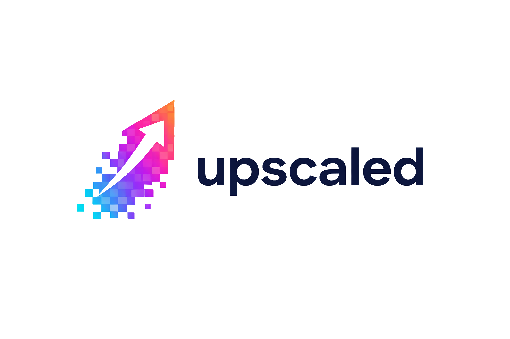

# AI Image Upscaler

An advanced image upscaling application that uses AI to enhance image resolution while maintaining quality. Built with Python, Flask, and PyTorch.

## Features

- Real-time image upscaling
- Web-based user interface
- Support for multiple image formats
- High-quality output using AI-powered upscaling
- Automatic image processing and optimization

## Prerequisites

- Python 3.9+
- PyTorch
- Flask
- Other dependencies (listed in requirements.txt)
- Node.js 18+ (for Electron desktop app)

## Installation

1. Clone the repository:

```bash
git clone https://github.com/bhumitschaudhry/upscaled.git
cd upscaled
```

2. Install dependencies:

```bash
pip install -r requirements.txt
```

3. Download the model file:

- Ensure `generator.pth` is in the root directory

## Usage

### Web (Flask)

1. Start the Flask server:

```bash
python app.py
```

2. Open your web browser and navigate to `http://localhost:5000`
3. Upload an image through the web interface
4. Wait for the processing to complete
5. Download your upscaled image

### Desktop (Electron)

1. Install Node dependencies:

```bash
npm install
```

2. Ensure Python dependencies are installed:

```bash
pip install -r requirements.txt
```

3. Start the desktop app:

```bash
npm start
```

This launches Electron, which starts the Flask backend automatically and loads it inside a desktop window.

## Build (Desktop)

Packaging is OS-specific. Run the build on the target OS you want to ship for (macOS/Linux/Windows).

- Directory build:

```bash
npm run pack
```

- Installer build:

```bash
npm run dist
```

## Notes

- The packaged desktop app currently uses the system Python runtime on the machine.
  - If Python is not on PATH, set `UPSCALED_PYTHON` to your python executable path and relaunch.

## Configuration

The application uses default settings optimized for most use cases. You can modify the following in the code:

- Maximum image size
- Output quality
- Scaling factor
- Processing parameters

## License

This project is licensed under the MIT License - see the LICENSE file for details.

## Contact

For any queries or suggestions, please open an issue in the GitHub repository.
